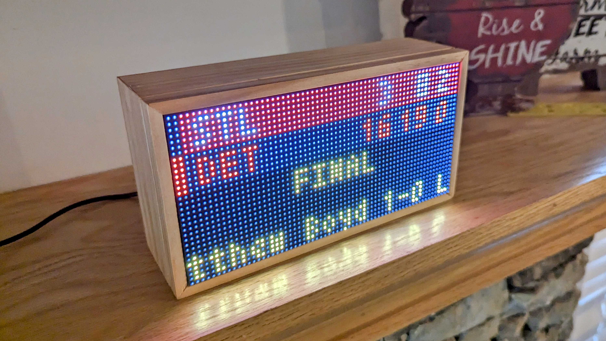
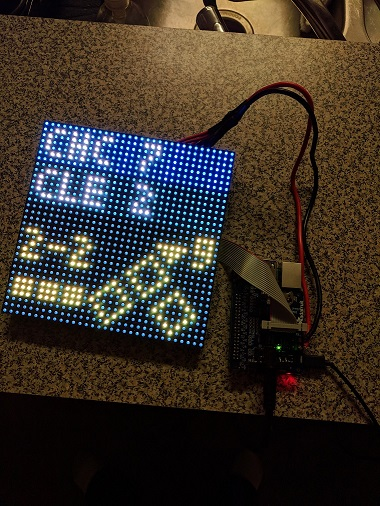
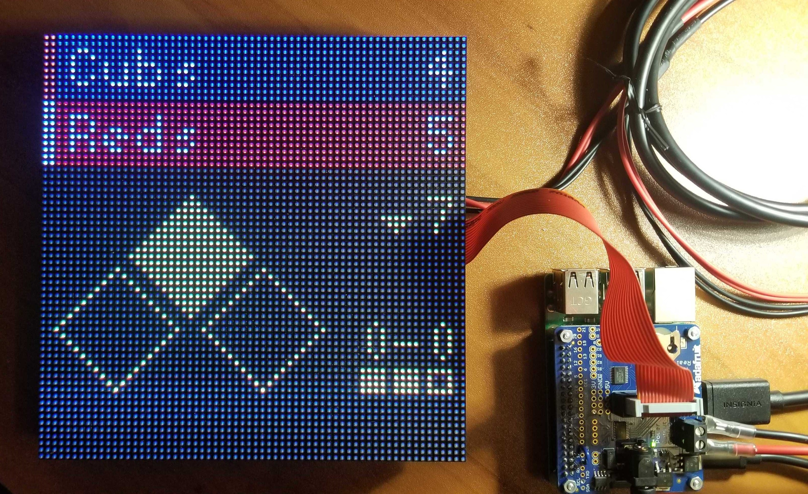
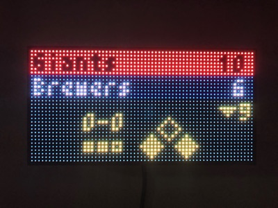
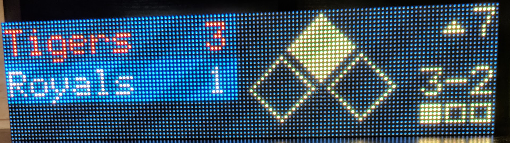
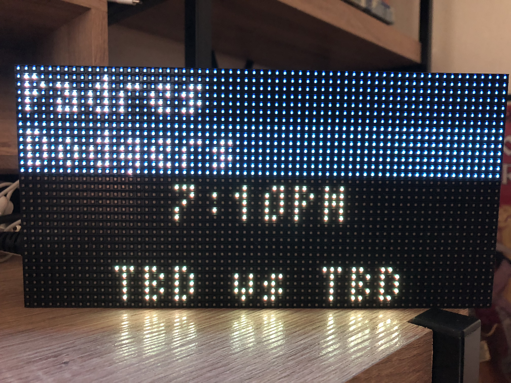
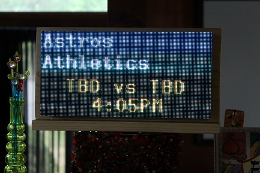
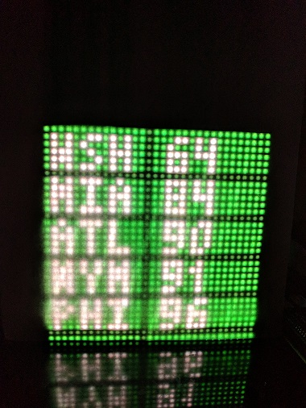

# mlb-led-scoreboard

 

[](https://discord.gg/FdD6ec9fdt)

<a href="assets/img/header.jpg">
  
</a>

---------------
> [!IMPORTANT]  
> If you are upgrading from v7 to v8, please be sure to read the [Usage](#usage) section, as the startup commands have changed!
---------------

An LED scoreboard for Major League Baseball. Displays a live scoreboard for your team's game on that day.

Requires a Raspberry Pi and an LED board hooked up via the GPIO pins.

**Currently supported boards:**
 * 32x32 (Limited number of features)
 * 64x32 (the _most_ supported)
 * 64x64
 * 128x32
 * 128x64

If you'd like to see support for another set of board dimensions, or have design suggestions for an existing one, file an issue!

**Pi's with known issues**
 * Raspberry Pi Zero has had numerous reports of slowness and unreliability during installation and running the software.

## Table of Contents
* [Features](#features)
  * [Live Games](#live-games)
  * [Pregame](#pregame)
  * [Division Standings](#division-standings)
* [Installation](#installation)
  * [Hardware Assembly](#hardware-assembly)
  * [Software Installation](#software-installation)
* [Usage](#usage)
  * [Configuration](#configuration)
  * [Flags](#flags)
* [Personalization](#personalization)
  * [Custom Board Layout](#custom-board-layout)
  * [Custom Colors](#custom-colors)
* [Sources](#sources)
  * [Accuracy Disclaimer](#accuracy-disclaimer)
* [Wiki](https://github.com/MLB-LED-Scoreboard/mlb-led-scoreboard/wiki)
* [Help and Contributing](#help-and-contributing)
  * [Latest Features](#latest-features)
* [Licensing](#licensing)
* [Other cool projects](#other-cool-projects)

## Features

### Live Games
It can display live games in action, and optionally rotate every 15 seconds through each game of the day.

The board refreshes the list of games every 15 minutes.

<a href="assets/img/cubs-indians-demo.jpg">
  
</a>
<a href="assets/img/pirates-cubs-demo.jpg">
  
</a>
<a href="assets/img/wide-final-demo.jpg">
  
</a>
<a href="assets/img/64x64-live.jpg">
  
</a>

<a href="assets/img/wide-ingame-demo.jpg">
  
</a>
<a href="assets/img/128x32-live.png">
  
</a>

### Pregame
If a game hasn't started yet, a pregame screen will be displayed with the probable starting pitchers.

<a href="assets/img/pregame.jpg">
  </a>
<a href="assets/img/128x64.png">
  </a>

### Division Standings
It can display standings for the provided division. Since the 32x32 board is too small to display wins and losses together, the wins and losses are alternated on the board every 5 seconds. You can also specify "NL Wild Card" or "AL Wild Card" as a 'division' to see the top 5 teams in each league's wild card race.

<a href="assets/img/standings-wins.jpg">
  
</a>
<a href="assets/img/standings-losses.jpg">
  
</a>
<a href="assets/img/wide-standings-demo.jpg">
  
</a>

## Installation
### Hardware Assembly
[See the wiki page for the original project for a step-by-step guide.](https://github.com/MLB-LED-Scoreboard/mlb-led-scoreboard/wiki) This README is primarily focused on the MLB software, but for those coming here from Reddit or elsewhere never having built things with a Raspberry Pi, this should help get you going.

A sample bill of materials (BOM) is located [here](https://www.adafruit.com/wishlists/527606)

### Software Installation
#### Requirements
You need Git for cloning this repo and PIP for installing the scoreboard software.
```
sudo apt-get update
sudo apt-get install git python3-pip
```

#### Installing the scoreboard software
This installation process will take about 10-15 minutes. Raspberry Pis aren't the fastest of computers, so be patient!

```
git clone https://github.com/MLB-LED-Scoreboard/mlb-led-scoreboard.git
cd mlb-led-scoreboard/
sudo ./install.sh
```

This will create a Python Virtual Environment and install all of the required dependencies. The
virtual environment will be located at `mlb-led-scoreboard/venv/`.

This will install the rgbmatrix binaries, which we get from [another open source library](https://github.com/hzeller/rpi-rgb-led-matrix/tree/master/bindings/python#building). It controls the actual rendering of the scoreboard onto the LEDs. If you're curious, you can read through their documentation on how all of the lower level stuff works.

It will also install the following python libraries that are required for certain parts of the scoreboard to function.

* [tzlocal](https://github.com/regebro/tzlocal): Timezone libraries. These allow the scoreboard to convert times to your local timezone
* [feedparser](https://pypi.org/project/feedparser/): Used to fetch and parse RSS feeds. The scoreboard uses this to show news headlines.
* [pyowm](https://github.com/csparpa/pyowm): OpenWeatherMap API interactions. We use this to get the local weather for display on the offday screen. For more information on how to finish setting up the weather, visit the [weather section](#weather) of this README.
* [MLB-StatsAPI](https://pypi.org/project/MLB-StatsAPI/): The main library that fetches and parses all of the actual MLB data being displayed
* [RGBMatrixEmulator](https://github.com/ty-porter/RGBMatrixEmulator): The emulation library for the matrix display. Useful for running on MacOS or Linux, or for development.

#### Customizing the Installation

Additional flags are available for customizing your install:

```
-a, --skip-all          Skip all dependencies and config installation (equivalent to -c -p -m).
-c, --skip-config       Skip updating JSON configuration files.
-m, --skip-matrix       Skip building matrix driver dependency. Video display will default to emulator mode.
-p, --skip-python       Skip Python 3 installation. Requires manual Python 3 setup if not already installed.

-v, --no-venv           Do not create a virtual environment for the dependencies.
-e, --emulator-only     Do not install dependencies under sudo. Skips building matrix dependencies (equivalent to -m)
-d, --driver            Specify a branch name or commit SHA for the rpi-rgb-led-matrix library. (Optional. Defaults may change.)

-f, --force             Try to skip most errors and force install. May be able to recover from previous installer errors.

-h, --help              Display this help message
```

#### Installation on Non-Raspberry Pi Hardware

The installation script is designed for physical hardware. When attempting to install it on other platforms, you should not use `sudo` to install the dependencies. In addition, you can pass the `--emulator-only` argument to skip installation steps that aren't required.

```
sh install.sh --emulator-only
```

#### Updating

A basic update is simple, just pull down the new code:

```
git pull
```

However, it is a good idea to re-run the installation script, following prompts as necessary. This will install latest versions of software packages such as the matrix driver library, MLB APIs, and other dependencies. Additionally, custom configuration can be updated through this installer.

```
sudo ./install.sh
```

The team makes a best attempt to make sure new scoreboard versions are forward and backward compatible with other versions of the software, however this is not guaranteed. Additional guidance for installing certain versions (such as migrating from version 7 to version 8) will be provided in this README and the release notes where applicable.

#### Updating with Custom Configuration

If you have made custom changes to configuration files (such as `config.json`, `colors/*.json`, or `coordinates/*.json`), it is a good idea to check these after every update to make sure your config is compatible with any incoming changes.

The installer can attempt to keep your config in sync for you. At the end of the installation process, the following message is presented:

```
===================================================================================
  If you have custom configurations, colors, or coordinates, it's recommended to
  update them with the latest options at this time.

  This operation is automatic and will ensure you have up-to-date configuration.

  This action will NOT override any custom configuration you already have unless
  the option has been obsoleted and is no longer in use.
===================================================================================

Would you like to do this now? [Y/n]
```

Type `Y` to accept the prompt (or `N` if you would like to do this by hand), and the script will try to merge updates into your config. Before doing so, a backup will be created for each file, such as `config.json.bak`. If the configuration updater breaks your installation, you can remove the existing config and replace it with this backup.

#### Version Information

You can check the version information for your installation of mlb-led-scoreboard by running `python3 version.py`.

The latest version of the software is available [here](https://github.com/MLB-LED-Scoreboard/mlb-led-scoreboard/releases).

#### Time Zones
Make sure your Raspberry Pi's timezone is configured to your local time zone. They'll often have London time on them by default. You can change the timezone of your raspberry pi by running `sudo raspi-config`.

## Usage
The installation script adds a line to the top of `main.py` to automatically pick up the virtual environment.
This means re-activating the environment (`source ./venv/bin/activate`) is not a requirement.

`sudo ./main.py` Running as root is 100% an absolute must, or the matrix won't render.

**Adafruit HAT/Bonnet users: You must supply a command line flag:**

`sudo ./main.py --led-gpio-mapping="adafruit-hat"`

See the Flags section below for more flags you can optionally provide.

### Running on Other Platforms

The scoreboard can run on other platforms by means of software emulation via `RGBMatrixEmulator`. When running via the emulator, you do not need to prepend your startup commands with `sudo`:

```sh
./main.py
```

You can also force the scoreboard into emulation mode by using the `--emulated` flag:

```sh
./main.py --emulated
```

When running in emulation mode, you can continue to use your existing command line flags as normal.

See [RGBMatrixEmulator](https://github.com/ty-porter/RGBMatrixEmulator) for emulator configuration options.

### Configuration

A default `config.example.json` file is included for reference. Copy this file to `config.json` and modify the values as needed.

```
"preferred":                              Options for team and division preference
  "teams"                         Array   An array of preferred teams. The first team in the list will be used as your 'favorite' team. Example: ["Cubs", "Brewers"]
  "divisions"                     Array   An array of preferred divisions that will be rotated through in the order they are entered. Example: ["NL Central", "AL Central"]

"news_ticker":                            Options for displaying a nice clock/weather/news ticker screen
  "always_display"                Bool    Display the news ticker screen at all times. Supercedes the standings setting.
  "team_offday"                   Bool    Display the news ticker when your prefered team is on an offday.
  "preferred_teams"               Bool    Include headlines from your list of preferred teams. Will only use the first 3 teams listed in your preferred teams.
  "display_no_games_live"         Bool    Display news and weather when none of your games are currently live.
  "traderumors"                   Bool    Include headlines from mlbtraderumors.com for your list of preferred teams. Will only use the first 3 teams listed in your preferred teams.
  "mlb_news"                      Bool    Include MLB's frontpage news.
  "countdowns"                    Bool    Include various countdowns in the ticker.
  "date"                          Bool    Display today's date to start the ticker. This will always be enabled if no other ticker options are.
  "date_format"                   String  Display the date with a given format. You can check all of the date formatting options at https://strftime.org

"standings":                              Options for displaying standings for a division
  "always_display"                Bool    Display standings for your preferred divisions.
  "mlb_offday"                    Bool    Display standings for your preferred divisions when there are no games on the current day.
  "team_offday"                   Bool    Display standings for your preferred divisions when the one of your preferred teams is not playing on the current day.
  "display_no_games_live"         Bool    Display standings when none of your games are currently live.

"rotation":                               Options for rotation through the day's games
  "enabled"                       Bool    Rotate through each game of the day according to the configured `rates`.
  "scroll_until_finished"         Bool    If scrolling text takes longer than the rotation rate, wait to rotate until scrolling is done.
  "only_preferred"                Bool    Only rotate through games in your preferred teams.
  "only_live"                     Bool    Only rotate through games which are currently playing. Can be composed with `only_preferred`.
  "rates"                         Dict    Dictionary of Floats. Each type of screen can use a different rotation rate. Valid types: "live", "pregame", "final".

  "while_preferred_team_live":            Options for rotating between screens while one of your preferred teams is live
    "enabled"                     Bool    Enable rotation while a preferred team is live.
    "during_inning_breaks"        Bool    Enable rotation while a preferred team is live during an inning break.

"weather":                                Options for retrieving the weather
  "apikey"                        String  An API key is required to use the weather service.
                                          You can get one for free at Open Weather Map (https://home.openweathermap.org/users/sign_up).
  "location"                      String  The `{city name},{state code},{country code}` according to ISO-3166 standards (https://www.iso.org/obp/ui/#search).
                                          Check out the OpenWeather documentation (https://openweathermap.org/current#name) for more info.
                                          Ex: `"Chicago,il,us"`
  "metric_units"                  Bool    Change the weather display to metric units (Celsius, m/s) instead of imperial (Fahrenheit, MPH).
  "pregame"                       Bool    If enabled, will display the weather for the game's location on the pregame screen.

"time_format"                     String  Sets the preferred hour format for displaying time. Accepted values are "12h" or "24h" depending on which you prefer.
"end_of_day"                      String  A 24-hour time you wish to consider the end of the previous day before starting to display the current day's games. Uses local time from your Pi.
"scrolling_speed"                 Integer Sets how fast the scrolling text scrolls. Supports an integer between 0 and 6.
"sync_delay_seconds"              Integer Delays game updates to sychronize with broadcasts. May introduce delay before rendering live games. Must be at least 0, defaults to 0 (no delay).
"api_refresh_rate"                Integer Refresh the game data from the MLB API every X seconds. Must be at least 3, default is 10.
"debug"                           Bool    Game and other debug data is written to your console.
"demo_date"                       String  A date in the format YYYY-MM-DD from which to pull data to demonstrate the scoreboard. A value of `false` will disable demo mode.
```

### Synchronizing with Broadcasts

You can manually delay live game updates to synchronize the scoreboard to live broadcasts. The API is typically faster than video feeds, so you may wish to delay the scoreboard to compensate. You may specify the total delay via the `sync_delay_seconds` config option.

Note that the actual delay may be slightly higher than your specified setting since it is dependent on the API refresh rate. Therefore you may want to slightly **decrease** the sync delay to compensate.

### Additional Features
* Line score (RHE) - Runs are always shown on the games screen, but you can enable or adjust spacing of the line score display.  Take a look at the [coordinates readme file](/coordinates/README.md) for details.

* Pitch Data - Pitch data can be shown on the game screen, See the [coordinates readme file](/coordinates/README.md) for details. In addition, the `short` and `long` pitch description can be changed in data/pitches.py

* Previous Play Data - Data for the previous play can be shown on the game screen. See the [coordinates readme file](/coordinates/README.md) for details. Long and short play descriptions can be changed in data/plays.py
  * **NOTE:** Because play result data is ephemeral, not every play result will be displayed. Situations like a mound visit, injury, or other timeout immediately following a play often cause the play result to be immediately replaced on the MLB API.

### Flags

You can configure your LED matrix with the same flags used in the [rpi-rgb-led-matrix](https://github.com/hzeller/rpi-rgb-led-matrix) library. More information on these arguments can be found in the library documentation.
```
--led-rows                Display rows. 16 for 16x32, 32 for 32x32. (Default: 32)
--led-cols                Panel columns. Typically 32 or 64. (Default: 32)
--led-chain               Daisy-chained boards. (Default: 1)
--led-parallel            For Plus-models or RPi2: parallel chains. 1..3. (Default: 1)
--led-pwm-bits            Bits used for PWM. Range 1..11. (Default: 11)
--led-brightness          Sets brightness level. Range: 1..100. (Default: 100)
--led-gpio-mapping        Hardware Mapping: regular, adafruit-hat, adafruit-hat-pwm
--led-scan-mode           Progressive or interlaced scan. 0 = Progressive, 1 = Interlaced. (Default: 1)
--led-pwm-lsb-nanosecond  Base time-unit for the on-time in the lowest significant bit in nanoseconds. (Default: 130)
--led-show-refresh        Shows the current refresh rate of the LED panel.
--led-slowdown-gpio       Slow down writing to GPIO. Range: 0..4. (Default: 1)
--led-no-hardware-pulse   Don't use hardware pin-pulse generation.
--led-rgb-sequence        Switch if your matrix has led colors swapped. (Default: RGB)
--led-pixel-mapper        Apply pixel mappers. e.g Rotate:90, U-mapper
--led-row-addr-type       0 = default; 1 = AB-addressed panels. (Default: 0)
--led-multiplexing        Multiplexing type: 0 = direct; 1 = strip; 2 = checker; 3 = spiral; 4 = Z-strip; 5 = ZnMirrorZStripe; 6 = coreman; 7 = Kaler2Scan; 8 = ZStripeUneven. (Default: 0)
--led-limit-refresh       Limit refresh rate to this frequency in Hz. Useful to keep a constant refresh rate on loaded system. 0=no limit. Default: 0
--led-pwm-dither-bits     Time dithering of lower bits (Default: 0)
--config                  Specify a configuration file name other, omitting json xtn (Default: config)
--emulated                Force the scoreboard to run in software emulation mode.
--drop-privileges         Force the matrix driver to drop root privileges after setup. (Default: true)
```

## Personalization
If you're feeling adventurous (and we highly encourage it!), the sections below outline how you can truly personalize your scoreboard and make it your own!

### Custom Board Layout
You have the ability to customize the way things are placed on the board (maybe you would prefer to see scrolling text for a pregame a bit higher or lower). See the `coordinates/` directory for more information.

### Custom Colors
You have the ability to customize the colors of everything on the board. See the `colors/` directory for more information.

### Weather
This scoreboard will use a weather API to gather weather information at various times. This information is displayed on your teams' offdays for your area and also displayed during each game's pregame information. The weather API we use is from OpenWeatherMaps. OpenWeatherMaps API requires an API key to fetch this data so you will need to take a quick minute to sign up for an account and copy your own API key into your `config.json`.

You can find the signup page for OpenWeatherMaps at [https://home.openweathermap.org/users/sign_up](https://home.openweathermap.org/users/sign_up). Once logged in, you'll find an `API keys` tab where you'll find a default key was already created for you. You can copy this key and paste it into the `config.json` under `"weather"`, `"apikey"`.

You can change the location used by entering your city, state, and country code separated by commas. If you wish to use metric measurements, set the `"metric"` option to `true`.

## Sources
This project relies on two libraries:
[MLB-StatsAPI](https://pypi.org/project/MLB-StatsAPI/) is the Python library used for retrieving live game data.
[rpi-rgb-led-matrix](https://github.com/hzeller/rpi-rgb-led-matrix) is the library used for making everything work with the LED board.

### Accuracy Disclaimer
The scoreboard updates frequently, but it cannot retrieve information that MLB has not yet made available. If something is odd or it seems behind, the first suspect is the MLB web API.

## Help and Contributing
If you run into any issues and have steps to reproduce, open an issue. If you have a feature request, open an issue. If you want to contribute a small to medium sized change, open a pull request. If you want to contribute a new feature, open an issue first before opening a PR.

### Run Unit Tests

PRs require passing unit tests in order to merge. You can run tests from the project root as follows:
```sh
python -m unittest
```

## Licensing
This project as of v1.1.0 uses the GNU Public License. If you intend to sell these, the code must remain open source.

## Other Cool Projects
The original version of this board

Inspired by this board, check out the [NHL scoreboard](https://github.com/riffnshred/nhl-led-scoreboard) 🏒
