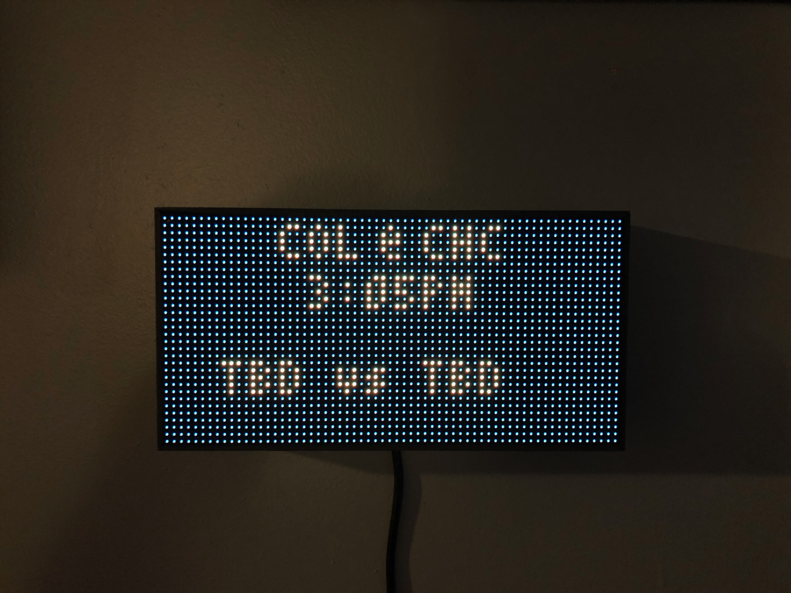

# mlb-led-scoreboard
An LED scoreboard for Major League Baseball. Displays a live scoreboard for your team's game on that day.

Requires a Raspberry PI and an LED board hooked up via the GPIO pins.

[](https://mlb-led-scoreboard.herokuapp.com/)

**Currently supported boards:**
 * 32x32
 * 64x32

If you'd like to see support for another set of board dimensions, file an issue!

## Table of Contents
* [Features](#features)
  * [Live Games](#live-games)
  * [Pregame](#pregame)
  * [Division Standings](#division-standings)
* [Installation](#installation)
  * [Hardware Assembly](#hardware-assembly)
  * [Software Installation](#software-installation)
* [Usage](#usage)
  * [Configuration](#configuration)
  * [Flags](#flags)
* [Sources](#sources)
  * [Accuracy Disclaimer](#accuracy-disclaimer)
* [Wiki](#wiki)
* [Help and Contributing](#help-and-contributing)
  * [Latest Features](#latest-features)
* [Licensing](#licensing)

## Features

### Live Games
It can display live games in action, and optionally rotate every 15 seconds through each game of the day.

The board refreshes the list of games every 15 minutes.

   

Sometimes you don't get baseball though :(


### Pregame
If a game hasn't started yet, a pregame screen will be displayed with the probable starting pitchers.

 

### Division Standings
It can display standings for the provided division. Since the 32x32 board is too small to display wins and losses together, the wins and losses are alternated on the board every 5 seconds.

  

## Installation
### Hardware Assembly
[See our wiki page.](https://github.com/MLB-LED-Scoreboard/mlb-led-scoreboard/wiki) This README is primarily focused on the MLB software, but for those coming here from Reddit or elsewhere never having built things with a Raspberry Pi, this should help get you going.

### Software Installation
```
git clone --recursive https://github.com/ajbowler/mlb-led-scoreboard
cd matrix/bindings/python
```
Then follow the instructions [in that directory](https://github.com/hzeller/rpi-rgb-led-matrix/tree/master/bindings/python#building). The README there will guide you through building the necessary binaries to run the Python samples (stuff like pulsing colors, running text on the screen, etc.)

**You cannot run this program until you have built the RGBMatrix binaries per the instructions in that README.**

A very important note not to forget is setting up the hardware you use. Make sure to edit the Makefile in the `lib/` directory to the right hardware description. I'm using `adafruit-hat` since I built this with an Adafruit HAT.

Then do the following:
```
cd .. # you should be in matrix/bindings now
sudo pip install -e python/
cd ../../ # you should be in mlb-led-scoreboard/ now
sudo pip install mlbgame pytz tzlocal
make
```

Recap of what you just did:
 * Installed a local Python module of the rgbmatrix library
 * Installed `mlbgame` to get your baseball data
 * Installed `pytz` and `tzlocal` to display all of your games with your Pi's timezone.

**Note on mlbgame**: If your installation fails with an error related to lxml, try running `pip install python-lxml`. Some users have reported issues with that particular module.

Another workaround for Raspberry Pi that other users have gotten to work is running `sudo apt-get install libxml2-dev libxslt-dev python-dev`

If you continue to run into issues, join our Slack channel located at the top of the README.

Install anything else your Pi yells at you for. I needed `python-dev` and a few native extensions for other stuff. Outside of scope of this project but this should at least help point people in the right direction.

#### Time Zones
Make sure your Raspberry Pi's timezone is configured to your local time zone. They'll often have London time on them by default.

## Usage
`sudo python main.py` Running as root is 100% an absolute must, or the matrix won't render.

### Configuration

A default `config.json.example` file is included for reference. Copy this file to `config.json` and modify the values as needed.

```
"preferred_team"              String  Pick a team to display a game for. Example: "Cubs"
"preferred_division"          String  Pick a division to display standings for when display_standings is true. Example: "NL Central"
"display_standings"           Bool    Display standings for the provided preferred_division.
"rotate_games"                Bool    Rotate through each game of the day every 15 seconds.
"rotate_rates"                Dict    Dictionary of Floats. Each type of screen can use a different rotation rate. Valid types: "live", "pregame", "final".
                              Float   A Float can be used to set all screen types to the same rotate rate.
"stay_on_live_preferred_team" Bool    Stop rotating through games when your preferred team is currently live.
"scroll_until_finished"       Bool    If scrolling text takes longer than the rotation rate, wait to rotate until scrolling is done.
"end_of_day"                  String  A 24-hour time you wish to consider the end of the previous day before starting to display the current day's games. Uses local time from your pi.
"slowdown_scrolling"          Bool    If your Pi is unable to handle the normal refresh rate while scrolling, this will slow it down.
"debug_enabled"               Bool    Game and other debug data is written to your console.
```

### Flags

You can configure your LED matrix with the same flags used in the [rpi-rgb-led-matrix](https://github.com/hzeller/rpi-rgb-led-matrix) library. More information on these arguments can be found in the library documentation.
```
--led-rows                Display rows. 16 for 16x32, 32 for 32x32. (Default: 32)
--led-cols                Panel columns. Typically 32 or 64. (Default: 32)
--led-chain               Daisy-chained boards. (Default: 1)
--led-parallel            For Plus-models or RPi2: parallel chains. 1..3. (Default: 1)
--led-pwm-bits            Bits used for PWM. Range 1..11. (Default: 11)
--led-brightness          Sets brightness level. Range: 1..100. (Default: 100)
--led-gpio-mapping        Hardware Mapping: regular, adafruit-hat, adafruit-hat-pwm
--led-scan-mode           Progressive or interlaced scan. 0 = Progressive, 1 = Interlaced. (Default: 1)
--led-pwm-lsb-nanosecond  Base time-unit for the on-time in the lowest significant bit in nanoseconds. (Default: 130)
--led-show-refresh        Shows the current refresh rate of the LED panel.
--led-slowdown-gpio       Slow down writing to GPIO. Range: 0..4. (Default: 1)
--led-no-hardware-pulse   Don't use hardware pin-pulse generation.
--led-rgb-sequence        Switch if your matrix has led colors swapped. (Default: RGB)
--led-row-addr-type       0 = default; 1 = AB-addressed panels. (Default: 0)
--led-multiplexing        Multiplexing type: 0 = direct; 1 = strip; 2 = checker; 3 = spiral. (Default: 0)
```

## Sources
This project relies on two libraries:
[MLBGame](https://github.com/panzarino/mlbgame) is the Python library used for retrieving live game data.
[rpi-rgb-led-matrix](https://github.com/hzeller/rpi-rgb-led-matrix) is the library used for making everything work with the LED board and is included as a submodule, so when cloning, make sure you add `--recursive`.

### Accuracy Disclaimer
The scoreboard is dependent on MLB having their data correct and up to date. If you see any weird data such as wrong pitches or scores or whatever else, MLB is drunk.

## Wiki
The wiki for this project has some cool things you can do to your Raspberry Pi, including steps on making your Pi a dedicated scoreboard runner!

## Help and Contributing
If you run into any issues and have steps to reproduce, open an issue. If you have a feature request, open an issue. If you want to contribute a small to medium sized change, open a pull request. If you want to contribute a new feature, open an issue first before opening a PR.

If you just want to talk, join the Slack channel, see the badge at the top of the README

### Latest Features
The scoreboard follows semantic versioning, for what makes sense for a project like this (it has no consumable API or anything like that). The `master` branch is always kept clean and never updated except for releases. If you want to contribute, make sure your pull request is pointed to `dev`.

## Licensing
This project as of v1.1.0 uses the GNU Public License. If you intend to sell these, the code must remain open source.
