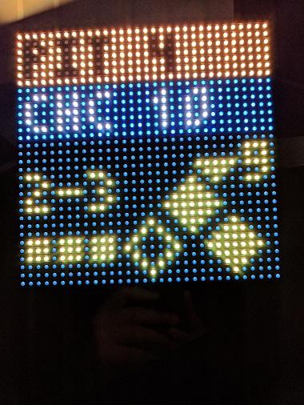
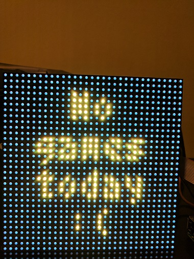
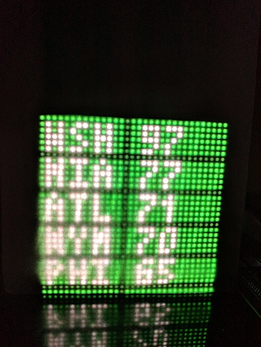
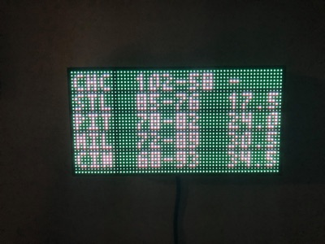

# mlb-led-scoreboard

## Brian Ward's fork

This version differs rather signficantly from the original, including tweaks to behavior, visuals, and different underlying code. 

Some broad changes: the code is now running on Python 3.7+, it is multithreaded to make animations smoother, and more information such as pitcher and the current batter are shown. A lot more is changed under the hood, too! A more detailed (but growing outdated) review is [here](https://github.com/MLB-LED-Scoreboard/mlb-led-scoreboard/pull/335).

---------------

An LED scoreboard for Major League Baseball. Displays a live scoreboard for your team's game on that day.

Requires a Raspberry Pi and an LED board hooked up via the GPIO pins.


**Currently supported boards:**
 * 32x32 (Limited number of features)
 * 64x32 (the _most_ supported)
 * 64x64
 * 128x32
 * 128x64

If you'd like to see support for another set of board dimensions, or have design suggestions for an existing one, file an issue!

**Pi's with known issues**
 * Raspberry Pi Zero has had numerous reports of slowness and unreliabilty during installation and running the software.

## Table of Contents
* [Features](#features)
  * [Live Games](#live-games)
  * [Pregame](#pregame)
  * [Division Standings](#division-standings)
* [Installation](#installation)
  * [Hardware Assembly](#hardware-assembly)
  * [Software Installation](#software-installation)
* [Usage](#usage)
  * [Configuration](#configuration)
  * [Flags](#flags)
* [Personalization](#personalization)
  * [Custom Board Layout](#custom-board-layout)
  * [Custom Colors](#custom-colors)
* [Sources](#sources)
  * [Accuracy Disclaimer](#accuracy-disclaimer)
* [Wiki](#wiki)
* [Help and Contributing](#help-and-contributing)
  * [Latest Features](#latest-features)
* [Licensing](#licensing)
* [Other cool projects](#other-cool-projects)

## Features

### Live Games
It can display live games in action, and optionally rotate every 15 seconds through each game of the day.

The board refreshes the list of games every 15 minutes.

      

Sometimes you don't get baseball though :(



### Pregame
If a game hasn't started yet, a pregame screen will be displayed with the probable starting pitchers.


### Division Standings
It can display standings for the provided division. Since the 32x32 board is too small to display wins and losses together, the wins and losses are alternated on the board every 5 seconds.

  

## Installation
### Hardware Assembly
[See the wiki page for the original project for a step-by-step guide.](https://github.com/MLB-LED-Scoreboard/mlb-led-scoreboard/wiki) This README is primarily focused on the MLB software, but for those coming here from Reddit or elsewhere never having built things with a Raspberry Pi, this should help get you going.

My parts list specifically is located [here](https://www.adafruit.com/wishlists/527606)

### Software Installation
#### Requirements
You need Git for cloning this repo and PIP for installing the scoreboard software.
```
sudo apt-get update
sudo apt-get install git python3-pip
```

#### Installing the scoreboard software
This installation process will take about 10-15 minutes. Raspberry Pis aren't the fastest of computers, so be patient!

```
git clone https://github.com/WardBrian/mlb-led-scoreboard.git
cd mlb-led-scoreboard/
sudo ./install.sh
```

This will install the rgbmatrix binaries, which we get from [another open source library](https://github.com/hzeller/rpi-rgb-led-matrix/tree/master/bindings/python#building). It controls the actual rendering of the scoreboard onto the LEDs. If you're curious, you can read through their documentation on how all of the lower level stuff works.

It will also install the following python libraries that are required for certain parts of the scoreboard to function.

* [tzlocal](https://github.com/regebro/tzlocal): Timezone libraries. These allow the scoreboard to convert times to your local timezone
* [feedparser](https://pypi.org/project/feedparser/): Used to fetch and parse RSS feeds. The scoreboard uses this to show news headlines.
* [pyowm](https://github.com/csparpa/pyowm): OpenWeatherMap API interactions. We use this to get the local weather for display on the offday screen. For more information on how to finish setting up the weather, visit the [weather section](#weather) of this README.
* [MLB-StatsAPI](https://pypi.org/project/MLB-StatsAPI/): The main library that fetches and parses all of the actual MLB data being displayed, alongside [mlbgame](https://github.com/panzarino/mlbgame) which primarily fetches important dates like the start of the All-Star break.


#### Updating
* Run `git pull` in your mlb-led-scoreboard folder to fetch the latest changes. A lot of the time, this will be enough, but if something seems broken:
    * **Re-run the install file**. Run `sudo ./install.sh` again. Any additional dependencies that were added with the update will be installed this way. If you are moving to a new major release version, answer "Y" to have it make you a new config file.
    * **Check your custom layout/color files if you made any**. There's a good chance some new keys were added to the layout and color files. These changes should just merge right in with the customized .json file you have but you might want to look at the new .json.example files and see if there's anything new you want to customize.

That should be it! Your latest version should now be working with whatever new fangled features were just added.

#### Time Zones
Make sure your Raspberry Pi's timezone is configured to your local time zone. They'll often have London time on them by default. You can change the timezone of your raspberry pi by running `sudo raspi-config`.

## Usage
`sudo python main.py` Running as root is 100% an absolute must, or the matrix won't render.

**Adafruit HAT/Bonnet users: You must supply a command line flag:**

`sudo python main.py --led-gpio-mapping="adafruit-hat"`

See the Flags section below for more flags you can optionally provide.

### Configuration

A default `config.json.example` file is included for reference. Copy this file to `config.json` and modify the values as needed.

```
"preferred":                           Options for team and division preference
  "teams"                      Array   Pass an array of preferred teams. The first team in the list will be used as your 'favorite' team. Example: ["Cubs", "Brewers"]
  "divisions"                  Array   Pass an array of preferred divisions that will be rotated through in the order they are entered. Example: ["NL Central", "AL Central"]

"news_ticker":                         Options for displaying a nice clock/weather/news ticker screen
  "always_display"             Bool    Display the news ticker screen at all times (supercedes the standings setting)
  "team_offday"                Bool    Display the news ticker when your prefered team is on an offday
  "preferred_teams"            Bool    Include headlines from your list of preferred teams. Will only use the first 3 teams listed in your preferred teams
  "traderumors"                Bool    Include headlines from mlbtraderumors.com for your list of preferred teams. Will only use the first 3 teams listed in your preferred teams
  "mlb_news"                   Bool    Include MLB's frontpage news
  "countdowns"                 Bool    Include various countdowns in the ticker.
  "date"                       Bool    Display today's date to start the ticker. This will always be enabled if no other ticker options are.
  "date_format"                String  Display the date with a given format. You can check all of the date formatting options at [strftime.org](strftime.org)

"standings":                           Options for displaying standings for a division
  "always_display"             Bool    Display standings for the provided preferred_divisions.
  "mlb_offday"                 Bool    Display standings for the provided preferred_divisions when there are no games on the current day.
  "team_offday"                Bool    Display standings for the provided preferred_divisions when the preferred_teams is not playing on the current day.
  "display_no_games_live"      Bool    Display standings when none of your games are currently live.

"rotation":                            Options for rotation through the day's games
  "enabled"                    Bool    Rotate through each game of the day every 15 seconds.
  "scroll_until_finished"      Bool    If scrolling text takes longer than the rotation rate, wait to rotate until scrolling is done.
  "only_preferred"             Bool    Only rotate through games in your preferred_teams list.
  "only_live"                  Bool    Only rotate through games which are currently playing. Can be composed with only_preferred.
  "rates"                      Dict    Dictionary of Floats. Each type of screen can use a different rotation rate. Valid types: "live", "pregame", "final".
                               Float   A Float can be used to set all screen types to the same rotate rate.

  "while_preferred_team_live":         Options for rotating while your chosen preferred_teams is live
    "enabled"                  Bool    Rotation is enabled while your configured preferred_teams game is live.
    "during_inning_breaks"     Bool    Rotation is enabled while your configured preferred_teams game is live during an inning break.

"weather":                             Options for retrieving the weather
  "apikey"                     String  An API key is requires to use the weather service. You can get one for free at [Open Weather Map](https://home.openweathermap.org/users/sign_up).
  "zipcode"                    String  The zipcode/postcode for the location you wish to receive weather data
  "country"                    String  The ISO 3166 country code associated with the zipcode
  "metric_units"               Bool    Set true for celsius and meters/s. Set false for fahrenheit and miles per hour.

"time_format"                  String  Sets the preferred hour format for displaying time. Accepted values are "12h" or "24h" depending on which you prefer.
"end_of_day"                   String  A 24-hour time you wish to consider the end of the previous day before starting to display the current day's games. Uses local time from your pi.
"full_team_names"              Bool    If true and on a 64-wide board, displays the full team name on the scoreboard instead of their abbreviation. This config option is ignored on 32-wide boards. Defaults to true when on a 64-wide board.
"scrolling_speed"              Integer Supports an integer between 0 and 4. Sets how fast the scrolling text scrolls.
"debug"                        Bool    Game and other debug data is written to your console.
"demo_date"                    String  A date in the format YYYY-MM-DD from which to pull data to demonstrate the scoreboard. A value of `false` will disable demo mode.
```

### Flags

You can configure your LED matrix with the same flags used in the [rpi-rgb-led-matrix](https://github.com/hzeller/rpi-rgb-led-matrix) library. More information on these arguments can be found in the library documentation.
```
--led-rows                Display rows. 16 for 16x32, 32 for 32x32. (Default: 32)
--led-cols                Panel columns. Typically 32 or 64. (Default: 32)
--led-chain               Daisy-chained boards. (Default: 1)
--led-parallel            For Plus-models or RPi2: parallel chains. 1..3. (Default: 1)
--led-pwm-bits            Bits used for PWM. Range 1..11. (Default: 11)
--led-brightness          Sets brightness level. Range: 1..100. (Default: 100)
--led-gpio-mapping        Hardware Mapping: regular, adafruit-hat, adafruit-hat-pwm
--led-scan-mode           Progressive or interlaced scan. 0 = Progressive, 1 = Interlaced. (Default: 1)
--led-pwm-lsb-nanosecond  Base time-unit for the on-time in the lowest significant bit in nanoseconds. (Default: 130)
--led-show-refresh        Shows the current refresh rate of the LED panel.
--led-slowdown-gpio       Slow down writing to GPIO. Range: 0..4. (Default: 1)
--led-no-hardware-pulse   Don't use hardware pin-pulse generation.
--led-rgb-sequence        Switch if your matrix has led colors swapped. (Default: RGB)
--led-pixel-mapper        Apply pixel mappers. e.g Rotate:90, U-mapper
--led-row-addr-type       0 = default; 1 = AB-addressed panels. (Default: 0)
--led-multiplexing        Multiplexing type: 0 = direct; 1 = strip; 2 = checker; 3 = spiral; 4 = Z-strip; 5 = ZnMirrorZStripe; 6 = coreman; 7 = Kaler2Scan; 8 = ZStripeUneven. (Default: 0)
--led-limit-refresh=<Hz>  : Limit refresh rate to this frequency in Hz. Useful to keep a constant refresh rate on loaded system. 0=no limit. Default: 0
--led-pwm-dither-bits   : Time dithering of lower bits (Default: 0)
--config                  Specify a configuration file name other, omitting json xtn (Default: config)
```

## Personalization
If you're feeling adventurous (and we highly encourage it!), the sections below outline how you can truly personalize your scoreboard and make it your own!
### Custom Board Layout
You have the ability to customize the way things are placed on the board (maybe you would prefer to see scrolling text for a pregame a bit higher or lower). See the `coordinates/` directory for more information.

### Custom Colors
You have the ability to customize the colors of everything on the board. See the `colors/` directory for more information.

### Weather
This scoreboard will use a weather API to gather weather information at various times. This information is displayed on your teams offdays for your area and also displayed during each game's pregame information. The weather API we use is from OpenWeatherMaps. OpenWeatherMaps API requires an API key to fetch this data so you will need to take a quick minute to sign up for an account and copy your own API key into your `config.json`.

You can find the signup page for OpenWeatherMaps at [https://home.openweathermap.org/users/sign_up](https://home.openweathermap.org/users/sign_up). Once logged in, you'll find an `API keys` tab where you'll find a default key was already created for you. You can copy this key and paste it into the `conig.json` under `"weather"`, `"apikey"`.

You can change the location used by entering your city, state, and country code separated by commas. If you wish to use metric measurments, set the `"metric"` option to `true`.

## Sources
This project relies on two libraries:
[MLB-StatsAPI](https://pypi.org/project/MLB-StatsAPI/) is the Python library used for retrieving live game data.
[rpi-rgb-led-matrix](https://github.com/hzeller/rpi-rgb-led-matrix) is the library used for making everything work with the LED board.

### Accuracy Disclaimer
The scoreboard updates frequently, but it cannot retrieve information that MLB has not yet made available. If something is odd or it seems behind, the first suspect is the MLB web API.

## Help and Contributing
If you run into any issues and have steps to reproduce, open an issue. If you have a feature request, open an issue. If you want to contribute a small to medium sized change, open a pull request. If you want to contribute a new feature, open an issue first before opening a PR.

## Licensing
This project as of v1.1.0 uses the GNU Public License. If you intend to sell these, the code must remain open source.

## Other Cool Projects
The original version of this board

Inspired by this board, check out the [NHL scoreboard](https://github.com/riffnshred/nhl-led-scoreboard) 🏒
